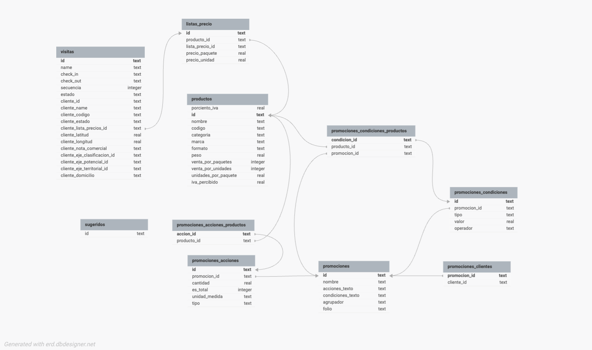

# ObtenerRuta

Este proceso de sincronización realiza la siguiente consulta SQL para obtener información de ruta desde Salesforce:

```sql
select id, name, Inicio_de_dia__c, Device_Id__c, Fin_de_dia__c, Fecha__c,
       Modulo__r.Fuerza_de_venta__r.Portafolio_de_Productos__c,
       Pais__c, Compania__c, Sucursal__c
from Avance_del_dia__c
where Fecha__c = TODAY
and (OwnerId = '[uid]' or Vendedor_volante__c = '[uid]')
```

La consulta devuelve la siguiente estructura JSON:

```json
{
	"ObtenerRuta": {
		"ruta": {
			"id": "string",
			"name": "string",
			"Device_Id__c": "string",
			"Inicio_de_dia__c": "string",
			"Fin_de_dia__c": "string",
			"Fecha__c": "date",
			"Fuerza_de_venta__r": {
				"Portafolio_de_Productos__c": "string"
			},
			"Pais__c": "string",
			"Compania__c": "string",
			"Sucursal__c": "string"
		}
	}
}
```

# SyncDown Visitas

Este proceso de sincronización realiza la siguiente consulta SQL para obtener información de visitas desde Salesforce:

```sql
select id, name, cliente__r.id, cliente__r.name, cliente__r.Latitud__c, cliente__r.Longitud__c,
       cliente__r.Lista_de_precios__c, cliente__r.Codigo_Cliente__c, cliente__r.Status__c,
       cliente__r.Marcas_sin_comprar__c, cliente__r.Eje_Potencial__c, cliente__r.NG_4_Id__c,
       cliente__r.Subgiro__c, cliente__r.Calle_de_facturacion__c, Check_In__c, Check_Out__c,
       Secuencia__c, Avance_del_dia__r.Modulo__r.Fuerza_de_venta__r.Portafolio_de_Productos__c
from Visita__c
where Avance_del_dia__c = '[rutaid]'
```

```json
{
	"SyncDownVisitas": {
		"visitas": [
			{
				"id": "string",
				"id": "string",
				"id": "string",
				"nombre": "string",
				"clienteId": "string",
				"cliente": "string",
				"lpId": "string",
				"clienteCodigo": "string",
				"clienteEstado": "string",
				"notaComercial": "string",
				"ejeClasificacionId": "string",
				"ejePotencialId": "string",
				"ejeTerritorialId": "string",
				"domicilio": "string",
				"latitud": "number",
				"longitud": "number",
				"inicio": "string",
				"fin": "string",
				"secuencia": "number",
				"estado": "string"
			}
		]
	}
}
```

# SyncDown Productos

Este proceso de sincronización realiza la siguiente consulta SQL para obtener información de productos desde Salesforce:

```sql
select id, Producto__c, Producto__r.SKU__c, Producto__r.name, Venta_por_unidades__c,
          Producto__r.Categoria__c, Producto__r.Marca__c, Producto__r.Formato__c,
          Producto__r.Categoria__r.name, Producto__r.Marca__r.name, Producto__r.Formato__r.name,
          Producto__r.de_IVA__c, Producto__r.de_IVA_Percibido__c, Producto__r.Unidades_Por_Paquete__c,
          Producto__r.Peso__c
from Producto_de_Portafolio__c
where Portafolio_de_Productos__c = '[portafolioid]'
```

```json
{
	"SyncDownProductos": {
		"productos": [
			{
				"id": "string",
				"nombre": "string",
				"codigo": "string",
				"categoria": "string",
				"marca": "string",
				"formato": "string",
				"peso": "number",
				"ventaPorPaquetes": true,
				"ventaPorUnidades": "boolean",
				"unidadesPorPaquete": "number",
				"porcientoIVA": "number",
				"ivaPercibido": "number"
			}
		]
	}
}
```

# SyncDownListasPrecio

Este proceso de sincronización realiza la siguiente consulta SQL para obtener información de listas de precios desde Salesforce:

```sql
select id, name, Producto__c, CurrencyIsoCode,
       Precio_Botella__c, Precio_Paquete__c, Lista_de_precios__c
from Entrada_lista_de_precios__c
where Lista_de_precios__c in ([listas])
and Fecha_inicio__c <= TODAY
and (Fecha_fin__c >= TODAY or Fecha_fin__c = null)
```

```json
{
	"SyncDownListasPrecio": {
		"precios": [
			{
				"id": "string",
				"productoId": "string",
				"lpId": "string",
				"precioPaquete": "number",
				"precioUnidad": "number"
			}
		]
	}
}
```

# SyncDownPromos

Esta sincronización no realiza una consulta directa SQL a Salesforce, sino más bien llama a un endpoint en la API

```csharp
 public async Task<Response> SyncDownPromos()
        {
            // resto del codigo
           var resp = await _srv.GetApiService("IncentivosAD", new SessionInfo() { Option = App.OpEnv },
                new GlobalItem() { Tag = new { AvanceDiaId = rutaid } });
            // resto del a logica si el llamado al endpoint
            // fue existoso

            //mas logica para procesar la informacion recibida del endpoint
        }
```

**GetApiService**

```csharp

public async Task<Response> GetApiService(string endpoint,
            SessionInfo sessionInfo,
            params GlobalItem[] paramList)
        {
            if(sessionInfo.Option ==2){
                //todo esto no nos importa
            }
            else{
                var respX = await SFHelper.EjecutarAPI(endpoint,
                    paramList[0].Tag);

                return respX;

            }

        }

```

**SFHelper**

```csharp
public static async Task<Response> EjecutarAPI(string nombreAPI,
            object data)
        {
            var resp = Autenticar();

            var client =
                new Salesforce.Force.ForceClient(resp.Data.InstanceUrl,
                    resp.Data.AccessToken,
                    resp.Data.ApiVersion);


            string response = "";

            dynamic value = null;
            try
            {
                value = await client.ExecuteRestApiAsync<dynamic>("IncentivosAD",
                    data);

                if (value.ToString()
                    .Contains("ERROR"))
                {
                    var rErr = JsonConvert.DeserializeObject<ApexResponseError>(value.ToString());
                    return new Response()
                    {
                        Message = rErr.error[0].message
                    };
                }
                else
                {
                    return new Response()
                    {
                        IsSuccess = true,
                        Value = value.ToString()
                    };
                }
            }
            catch (Salesforce.Common.ForceException ex)
            {
                return new Response()
                {
                    IsException = true,
                    Message = ex.Message
                };
            }
        }

```

Y en fin todo esto debería de devolver un JSON con la siguiente estructura:

```json

"SyncDownPromos": {
		"promociones": [
			{
				"nombre": "string",
				"accionesTexto": "string",
				"condicionesTexto": "string",
				"agrupador": "string",
				"id": "string",
				"folio": "string",
				"condiciones": [
					{
						"promocion": "string",
						"tipo": "string",
						"valor": "string",
						"operador": "string",
						"id": "string",
						"productos": ["string"]
					}
				],
				"clientes": ["string"],
				"acciones": [
					{
						"id": "string",
						"promocion": "string",
						"cantidad": "number",
						"esTotal": "boolean",
						"unidadMedida": "string",
						"tipo": "string",
						"productos": ["string"]
					}
				]
			}
		]
}

```

# SyncDown Sugeridos

Este proceso de sincronización realiza la siguiente consulta SQL para obtener listas sugeridas desde Salesforce:

Este es el código de todo lo que se hace hasta la consulta de la base de datos:

La verdad, no lo entiendo muy bien

```csharp
            var respV = App.LocalDb.ObtenerLista<Visita>();

            string ejeCla = "";

            string ejePo = "";

            if (respV.IsSuccess && respV.Data.Count > 0)
            {
                var listaC = respV.Data.GroupBy(x => x.EjeClasificacionId).Select(x => x.Key).ToList();
                var listaP = respV.Data.GroupBy(x => x.EjePotencialId).Select(x => x.Key).ToList();

                string sep = "";

                foreach (var s in listaC)
                {
                    ejeCla += sep + "'" + s + "'";
                    sep = ",";
                }

                sep = "";

                foreach (var s in listaP)
                {
                    ejePo += sep + "'" + s + "'";
                    sep = ",";
                }


                string consulta = "select id, name from Lista_sugeridos__c where " +
                                  string.Format(
                                      "Total_productos__c > 0 and Fecha_inicio__c <= TODAY and (Fecha_fin__c >= TODAY or Fecha_fin__c = null) and Estado__c = 'Activo' and Pais__c ='{0}' and " +
                                      "(" +
                                      "(CompaniaCode__c = '{1}' and SucursalCode__c ='{2}') or " +
                                      "(CompaniaCode__c = '{3}' and SucursalCode__c = null) or " +
                                      "(CompaniaCode__c = null and SucursalCode__c = null) or" +
                                      "(CompaniaCode__c = null and SucursalCode__c = '{4}')) and" +
                                      "((Eje_de_Clasificacion__c in ({5}) and Eje_potencial__c INCLUDES ({6})) or " +
                                      "(Eje_de_Clasificacion__c = null and Eje_potencial__c = null) or " +
                                      "(Eje_de_Clasificacion__c = null and Eje_potencial__c INCLUDES ({7})) or " +
                                      "(Eje_de_Clasificacion__c in ({8}) and Eje_potencial__c = null))",
                                      Globals.GetAppParam("pais"),
                                      Globals.GetAppParam("companiaid"),
                                      Globals.GetAppParam("sucursalid"),
                                      Globals.GetAppParam("companiaid"),
                                      Globals.GetAppParam("sucursalid"), ejeCla, ejePo, ejePo, ejeCla);
                var resp = await _srv.GetQuery(consulta, _sinfo);

            ///continua la logica

            }
```

Esta es la consulta pura

```sql
select id, name
from Lista_sugeridos__c
where Total_productos__c > 0
and Fecha_inicio__c <= TODAY
and (Fecha_fin__c >= TODAY or Fecha_fin__c = null)
and Estado__c = 'Activo'
and Pais__c = '{0}'
and (
    (CompaniaCode__c = '{1}' and SucursalCode__c = '{2}') or
    (CompaniaCode__c = '{3}' and SucursalCode__c = null) or
    (CompaniaCode__c = null and SucursalCode__c = null) or
    (CompaniaCode__c = null and SucursalCode__c = '{4}')
)
and (
    (Eje_de_Clasificacion__c in ({5}) and Eje_potencial__c INCLUDES ({6})) or
    (Eje_de_Clasificacion__c = null and Eje_potencial__c = null) or
    (Eje_de_Clasificacion__c = null and Eje_potencial__c INCLUDES ({7})) or
    (Eje_de_Clasificacion__c in ({8}) and Eje_potencial__c = null)
)
```

```json
{
	"SyncDownSugeridos": {
		"sugeridos": [
			{
				"id": "string",
				"nombre": "string"
			}
		]
	}
}
```

# VISUALIZACION DE DATOS RELACIONALES



# NO IMPLEMENTADO

En estos métodos del sync no hay lógica para realizar consultas.

-   **Syncdown Pedidos**
-   **SyncDown Clientes Modulo**
-   **SyncDown Prospectos**
